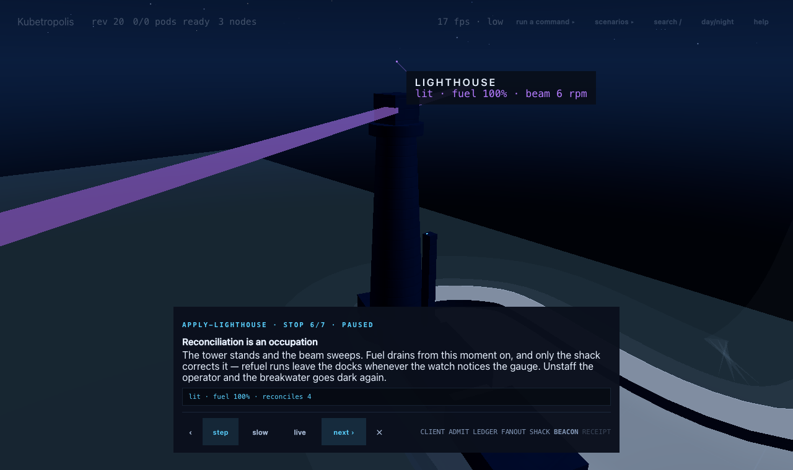

# Kubetropolis

**An explorable 3D city that shows how Kubernetes actually works.**

### ▶ Live: **https://jarededwards.github.io/kubetropolis/**



City Hall is the API server. The Hall of Records vault beneath it is etcd —
the only source of truth. The Zoning Office schedules, the Office of
Inspectors reconciles forever, districts are nodes, buildings are pods, and
container images arrive as cargo through a working harbor. Everything you see
is driven by a real, deterministic in-browser model of the control plane:
one write to the ledger, watched by couriers, reconciled by desks. Nothing
talks to anything except through the API server.

**Status: v1 feature-complete (M0–M8).** What's in the city:

- **Narrated trace rails** — run `kubectl apply -f pod.yaml` and step through
  every hop: the permit desk stamping defaults you didn't write, the vault
  committing a revision, couriers fanning out, the zoning map table striking
  and grading districts, the crane pulling your image, probes flipping Ready.
  The delete rail teaches the endpoint-withdrawal race with a live misroute
  counter and a one-click preStop fix. The Lighthouse rails teach CRDs: a law
  with no inspector is paper.
- **A ten-chapter guided tour** (press `T`) that fires real actions on camera
  — you delete a pod mid-chapter and watch the ReplicaSet desk order its
  replacement — and every chapter ends with a *your turn* the reader performs.
- **Twelve scenarios with operator decisions** — OOM leaks, registry outages,
  node loss with the honest 50-second and 300-second clocks, drains blocked by
  disruption budgets, HPA under rush hour, a control plane that stalls while
  the data plane keeps serving. The decisions are non-modal; the city keeps
  running while you choose.
- **An honesty discipline** — every number shown resolves to a sourced claim
  (`src/core/claims.ts`, kubernetes.io-cited); every simplification that could
  change a lesson is disclosed in [FIDELITY.md](FIDELITY.md); every knob's
  visible effect is proven in [KNOB-AUDIT.md](KNOB-AUDIT.md).

## Run it locally

```
npm install
npm run dev        # vite dev server on :5173
npm run preview    # serve the built site on :4173
npm run typecheck && npm test && npm run build
```

Requires WebGL2. Fully static; zero application network calls; three.js is
the only runtime dependency.

## Credits & provenance

Kubetropolis is inspired by — and vendors the rendering engine of —
[PGSimCity](https://github.com/NikolayS/PGSimCity) by Nikolay Samokhvalov
(Apache-2.0). The Kubernetes domain model, city design, and all teaching
content are original to this project. Per-file provenance: VENDORED.md.

## Legal

Kubetropolis is an independent, non-commercial educational project. It is not
affiliated with, sponsored by, or endorsed by The Linux Foundation or the
Cloud Native Computing Foundation. Kubernetes® is a registered trademark of
The Linux Foundation, used here only to refer to the technology itself; the
Kubernetes logo is not used. This project contains no SimCity code, assets,
artwork, logos, characters, audio, or game content. License: Apache-2.0 (see
LICENSE, NOTICE).
